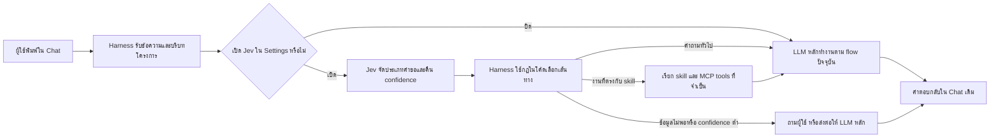

# ข้อเสนอ: เพิ่ม TypeSafe Jev เป็น internal decision tool ของ harness

**สถานะ:** เสนอเพื่อพิจารณา — ยังไม่มีการเปลี่ยน runtime
**วันที่ประเมิน:** 2026-09-19

## สรุปสำหรับการตัดสินใจ

Jev เหมาะกับการเป็นโมเดลตัดสินใจแบบมีโครงสร้างที่ harness เรียกใช้เฉพาะจุด เช่น จัดประเภทคำขอหรือให้คะแนนความชัดเจนของหลักฐาน ไม่เหมาะกับการแทน LLM หลัก เพราะ Jev คืนค่าแบบ `Choice`, `Score`, `Noul` พร้อมความน่าจะเป็น แทนการเขียนคำตอบ โค้ด หรือคำอธิบาย [TypeSafe: System One](https://docs.typesafe.ai/concepts/system-one) [TypeSafe: API reference](https://docs.typesafe.ai/api)

**ข้อเสนอ:** อนุมัติ POC แบบ opt-in โดยปิดเป็นค่าเริ่มต้น และเปิดเป็น internal tool ของ harness ผ่าน feature flag แยกจาก LLM profile ปัจจุบัน สำหรับ POC ให้ใช้ HTTP API ของ TypeSafe โดยตรงเพื่อคงรูปแบบ `state + questions` ที่เอกสารรองรับชัดเจน ส่วนการเรียกผ่าน OpenRouter ให้เป็นทางเลือกหลังทดสอบ request/response ของ Jev โดยเฉพาะแล้ว

เหตุผลที่ยังไม่ควรต่อ Jev เข้ากับ LLM client ปัจจุบันโดยตรง: provider ในระบบส่ง Chat Completions แบบ `messages`, `tools`, `tool_choice` และ streaming; TypeSafe อธิบาย Jev ด้วย endpoint และ schema อีกแบบหนึ่ง ส่วน OpenRouter ยืนยันว่ามี Jev ใน catalog และเรียกผ่าน API แบบ OpenAI-compatible ได้ แต่เอกสารที่ตรวจยังไม่ได้อธิบายว่า `questions` ของ TypeSafe ถูกส่งผ่าน OpenRouter อย่างไร [OpenRouter: Jev 1.13](https://openrouter.ai/typesafe/jev-1.13/) [OpenRouter: Quickstart](https://openrouter.ai/docs/quickstart) [TypeSafe: Quick start](https://docs.typesafe.ai/introduction/quickstart)

## Jev จะอยู่ตรงไหนในระบบ

ผู้ใช้ยังพิมพ์คุยในหน้า Chat เดิม และยังได้รับคำตอบในแชตเดิม Jev จะทำงานอยู่ฝั่ง backend ภายใน `NativeHarness` เป็นขั้นตัดสินใจก่อนส่งงานให้ LLM หลัก เมื่อเปิด Jev ไว้เท่านั้น:

สรุปตำแหน่งตามส่วนของระบบ:

- **หน้า Chat:** ไม่เพิ่มหน้าคุยกับ Jev แยก ผู้ใช้ไม่ต้องเลือกโมเดล Jev ทุกข้อความ
- **Settings:** เพิ่มสวิตช์ `Settings → Internal tools → Jev` และช่อง API key แยกจาก LLM profile; ปิดไว้เป็นค่าเริ่มต้น
- **Backend / Harness:** เรียก Jev เพื่อให้ผลแบบมีโครงสร้าง เช่น `business_analysis`, `summarize_sources`, `general_question` หรือ `needs_clarification` แล้วให้โค้ดของ harness เป็นผู้เลือกว่าจะทำอะไรต่อ
- **LLM หลัก, skills และ MCP tools:** ยังคงสร้างคำตอบและลงมือทำงาน Jev ไม่ตอบผู้ใช้เองและไม่เรียก tools เอง

ตัวอย่าง: ผู้ใช้พิมพ์ “ช่วยทำ requirements จากเอกสารโครงการ” → Jev อาจจัดเป็น `business_analysis` พร้อม confidence → harness เลือกเส้นทาง BA skill → LLM หลักทำงานร่วมกับ MCP/tools ตามปกติ → ผลลัพธ์แสดงในแชตเดิม หากปิด Jev ข้อความจะเข้า flow ปัจจุบันโดยตรง

**สถานะปัจจุบัน:** flow นี้เป็นภาพการวางตำแหน่งที่เสนอ ยังไม่มี Jev client, สวิตช์ Settings หรือการเรียก Jev ใน runtime

## Jev ทำอะไรได้

- รับ `state` เป็นข้อความ, JSON object หรือ array ของข้อความ และประเมินคำถามหลายข้อใน request เดียว [TypeSafe: API reference](https://docs.typesafe.ai/api)
- `Choice` เลือกหนึ่งตัวเลือกจากชุดที่ระบบกำหนดและคืน distribution; `Score` ประเมินตาม rubric; `Noul` คืนความน่าจะเป็นของคำตอบใช่/ไม่ใช่ [TypeSafe: API reference](https://docs.typesafe.ai/api)
- ค่า confidence ช่วยให้ระบบตัดสินใจว่าจะดำเนินต่อ ส่งให้ LLM หลัก หรือถามคนได้ แต่การ calibration เป็นคุณสมบัติโดยรวม ไม่รับประกันว่าคำตอบแต่ละครั้งถูกต้อง [TypeSafe: System One](https://docs.typesafe.ai/concepts/system-one)
- Jev รับเฉพาะ text และไม่สร้าง prose, code หรือคำอธิบายเหตุผล จึงไม่ควรใช้แทนคำตอบสุดท้ายหรือ tool call ของ agent [TypeSafe: System One](https://docs.typesafe.ai/concepts/system-one)
- TypeSafe ระบุว่า English ให้ความแม่นยำดีที่สุด และแนะนำให้ทดสอบภาษาอื่นรวมถึง CJK กับข้อมูลจริงก่อนใช้งาน เนื้อหาภาษาไทยของ workspace จึงต้องเป็นเกณฑ์ผ่านของ POC [TypeSafe: Models](https://docs.typesafe.ai/models)

บทความเปิดตัวของ TypeSafe รายงานความเร็วและต้นทุนที่ดีขึ้นสำหรับ workload ที่ออกแบบเป็น structured decisions พร้อมระบุข้อจำกัดของ evaluation เอง เช่น query ใน demo ถูกทำให้ง่าย และ workflow/evaluator มีที่มาจากทีมของบริษัท ควรถือ benchmark เหล่านั้นเป็นสมมติฐานสำหรับการทดลอง ไม่ใช่ผลรับประกันกับงานเอกสารไทยของเรา [TypeSafe: Introducing System One Models & Jev](https://typesafe.ai/blog/introducing-system-one-models-and-jev)

## ช่องทาง API และต้นทุน

| ทางเลือก | ข้อเท็จจริงที่ตรวจได้ | ผลต่อการเชื่อมระบบ |
|---|---|---|
| TypeSafe API โดยตรง | `POST https://api.typesafe.ai/v1/systemone`, Bearer API key, body มี `state`, `model`, `questions`; alias `jev-latest` ปัจจุบันชี้ไป `jev-1.13.0` [Quick start](https://docs.typesafe.ai/introduction/quickstart) [Models](https://docs.typesafe.ai/models) | ตรงกับ primitive ของ Jev; เพิ่ม client ภายในเฉพาะงานตัดสินใจ ไม่ต้องทำให้ Jev แกล้งเป็น chat model |
| OpenRouter | Jev อยู่ใน catalog เป็น `typesafe/jev-1.13` และ `~typesafe/jev-latest`; หน้ารุ่นแสดงราคา $0.042/M input, $0/M output และ context 32K [Jev 1.13](https://openrouter.ai/typesafe/jev-1.13/) [Jev Latest](https://openrouter.ai/~typesafe/jev-latest/) | ใช้ endpoint `https://openrouter.ai/api/v1` และ API key ของ OpenRouter ได้ แต่ต้องยืนยันวิธีส่ง typed questions กับ Jev ก่อนเลือกเป็น production path [OpenRouter Quickstart](https://openrouter.ai/docs/quickstart) |

TypeSafe ระบุราคาปัจจุบัน $0.042 ต่อหนึ่งล้าน input tokens และ output tokens ฟรี; การประเมิน 10,000 input tokens จึงอยู่ที่ประมาณ $0.00042 ตามราคา list ปัจจุบัน ยังไม่รวมค่าใช้จ่ายอื่นหรือการเปลี่ยนราคา [TypeSafe: Models](https://docs.typesafe.ai/models)

ตัวเลข context ต่างกันตามหน้าและช่องทาง: TypeSafe API ระบุงบรวม 64K tokens โดย `state` บวกคำถามที่ยาวที่สุดจำกัด 32K; OpenRouter catalog แสดง 32K context จึงควรใช้ 32K เป็นเพดานอนุรักษ์นิยมของ POC ผ่าน OpenRouter [TypeSafe: Models](https://docs.typesafe.ai/models) [OpenRouter: Jev 1.13](https://openrouter.ai/typesafe/jev-1.13/)

TypeSafe แจ้งว่า limit ปัจจุบันอาจเปลี่ยนได้ และ API อาจตอบ `429`/`529`; client ควรทำ exponential backoff และมี timeout [TypeSafe: Models](https://docs.typesafe.ai/models) [TypeSafe: API reference](https://docs.typesafe.ai/api)

## ความเข้ากันได้กับ codebase

- [`backend/app/llm/base.py`](../../backend/app/llm/base.py) กำหนด contract สำหรับ `complete`, `stream` และ tool calls
- [`backend/app/llm/openai_compatible.py`](../../backend/app/llm/openai_compatible.py) ส่ง OpenAI Chat Completions payload ไป `/chat/completions` และแปลงผลเป็นข้อความหรือ function calls
- [`backend/app/agent/harness.py`](../../backend/app/agent/harness.py) สร้าง tool schema และเรียก LLM หลักเพื่อขับ execution loop
- [`backend/app/llm/profiles.py`](../../backend/app/llm/profiles.py) และหน้า Settings จัดการ LLM profiles ปัจจุบัน ส่วน [`backend/app/secrets.py`](../../backend/app/secrets.py) เก็บ API keys ของ profile

ดังนั้น Jev ควรมี interface แยก เช่น `JevDecisionClient.evaluate(state, questions)` และถูกเรียกจากจุดที่โค้ดกำหนดไว้เท่านั้น ไม่ควรใส่เป็น function tool ใน schema ที่ LLM หลักเห็น เพราะ Jev คืนผลการตัดสินใจ ไม่ได้เรียกใช้ project tools เอง

TypeSafe Python SDK ระบุว่าต้องใช้ Python 3.10 ขึ้นไป แต่ runtime ปัจจุบันของ workspace เป็น Python 3.9.6; ถ้าทดลองก่อนอัปเกรด Python ให้เรียก HTTP API ผ่าน `httpx` ซึ่งมีอยู่แล้วใน `backend/requirements.txt` [TypeSafe Quick start](https://docs.typesafe.ai/introduction/quickstart)

## ขอบเขต POC ที่เสนอ

**Use case แรก:** ให้ Jev จัดประเภทคำขอ Cowork เป็นหนึ่งในตัวเลือกที่ระบบกำหนด เช่น `business_analysis`, `summarize_sources`, `general_question`, `needs_clarification` พร้อมคืน confidence จากนั้นโค้ดตัดสินใจว่าจะเรียก skill ที่มีอยู่ ส่งให้ LLM หลัก หรือถามผู้ใช้ ไม่ให้ Jev สั่ง tool หรือเขียน artifact โดยตรง

หลัง use case แรกผ่านเกณฑ์ อาจทดลองจัดประเภท passage จากเอกสารเป็น `requirement`, `constraint`, `actor`, `assumption` เพื่อช่วย workflow BA แล้วเทียบผลกับชุด label ที่คนตรวจแล้ว

### Toggle และ credential

1. เพิ่ม `internal_tools.jev.enabled` ใน app settings โดยค่าเริ่มต้นเป็น `false`; ปิดแล้ว harness ต้องไม่ส่ง request ไป TypeSafe/OpenRouter
2. เพิ่มส่วน **Internal tools → Jev** ใน Settings แยกจาก LLM profiles พร้อมสถานะเปิด/ปิด, provider, model ID และ test connection
3. เก็บ API key แยกจาก default chat LLM profile และไม่ส่ง key หรือ state เต็มกลับไป frontend
4. ตั้ง model เป็น version ที่ pin ได้ระหว่าง evaluation (`jev-1.13.0` สำหรับ TypeSafe API หรือ `typesafe/jev-1.13` ผ่าน OpenRouter); ใช้ alias latest หลังทดสอบรุ่นใหม่และบันทึก `response.model` เพื่อ audit [TypeSafe: Models](https://docs.typesafe.ai/models)

### พฤติกรรมเมื่อไม่มั่นใจหรือบริการใช้ไม่ได้

- จำกัดตัวเลือกของ `Choice` ให้ตรงกับทางเลือกที่โค้ดรองรับ และ validate response ก่อนนำไปใช้
- ตั้ง threshold จาก evaluation set; confidence ต่ำ, response ผิด schema, timeout, `429` หรือ `529` ให้กลับไปใช้เส้นทางเดิมของ LLM หลักหรือถามผู้ใช้ตามระดับความเสี่ยง
- ให้ logic ในโค้ดเป็นผู้ทำ action หลังตรวจคำตอบ Jev; อย่าใช้ผลโมเดลเพียงลำพังอนุมัติการเขียนภายนอก, ลบข้อมูล หรือข้าม human approval
- เก็บ metadata เท่าที่จำเป็น เช่น run ID, model version, question-set version, answer/confidence, latency และ token usage; หลีกเลี่ยงการบันทึก document state เต็มใน log

## ข้อมูลและความเป็นส่วนตัว

การเรียกตรง TypeSafe ส่ง `state` ไปยัง TypeSafe; บริษัทระบุว่าไม่นำ request/response ไปฝึกโมเดล และเสนอ ZDR สำหรับลูกค้า Enterprise ส่วนการเก็บข้อมูลให้ยึด DPA และ privacy policy ของบัญชีที่ใช้งาน [TypeSafe: Models](https://docs.typesafe.ai/models) [TypeSafe: Legal](https://docs.typesafe.ai/legal)

OpenRouter ระบุว่าไม่เก็บ prompt/completion เป็นค่าเริ่มต้น แต่ส่ง request ต่อไปยัง model provider และแนวทาง retention/training ขึ้นกับ provider และ endpoint ที่ถูกเลือก จึงต้องตรวจ policy ของ endpoint TypeSafe จริงก่อนส่งเอกสารโครงการที่มีข้อมูลอ่อนไหว [OpenRouter: Support](https://openrouter.ai/support) [OpenRouter: Privacy / ZDR](https://openrouter.ai/docs/guides/features/zdr)

ระบบมี local `SecretStore` แต่เอกสารในโค้ดระบุชัดว่าเป็นการป้องกันสำหรับ local app ไม่ใช่ secret manager ที่เหมาะกับ production [backend/app/secrets.py](../../backend/app/secrets.py) ควรใช้ environment/secret injection สำหรับ POC ที่แชร์เครื่องหรือมีหลายผู้ใช้ และตัดสินใจเรื่อง secret storage ก่อนเปิดใช้ร่วมกัน

## เกณฑ์ตัดสิน POC

- ทดสอบชุดคำขอจริงทั้งภาษาไทยและอังกฤษที่มี label ตรวจโดยคน; วัด precision/recall ของแต่ละ route, false route, calibration/confidence, p50/p95 latency, error rate และต้นทุนจริง
- เทียบกับ baseline ปัจจุบันของ LLM/harness ด้วย input และ rubric ชุดเดียวกัน; benchmark ที่ TypeSafe เผยแพร่ไม่แทน evaluation ของเรา
- ต้องพิสูจน์ว่า toggle ปิดแล้วไม่มี network call และ behavior กลับไปเส้นทางเดิม
- ต้องทดสอบ provider/API จริงให้ยืนยัน payload, output mapping, model ID, rate-limit handling และ data policy ก่อนปล่อย toggle ให้ผู้ใช้
- กำหนด threshold ยอมรับได้หลังเห็น baseline; ถ้า Thai classification หรือ confidence gating ไม่ผ่าน ให้คง Jev ปิดไว้และไม่ผูกเข้ากับเส้นทางสำคัญ

## ตัวเลือกที่ต้องตัดสินใจ

1. **อนุมัติ POC ผ่าน TypeSafe API โดยตรง (ข้อเสนอแนะ):** ใช้ interface `state/questions`, เริ่มจาก request routing, toggle ปิดเป็นค่าเริ่มต้น และเก็บ key แยกจาก LLM profile
2. **ให้ทดลองผ่าน OpenRouter ก่อน:** ใช้ Jev slug ที่ catalog ระบุ แต่ให้ POC ยืนยัน typed-question request shape/response mapping และ policy ของ endpoint ก่อนออกแบบ adapter ถาวร
3. **พักไว้ก่อน:** รอผลทดสอบภาษาไทย, retention terms หรือข้อมูล request contract ที่ชัดเจนขึ้น

**ขอบเขตหลังอนุมัติ:** เอกสารนี้เป็นข้อเสนอ ยังไม่ได้เพิ่ม API key, provider adapter, settings toggle หรือการเรียก Jev ใน harness
