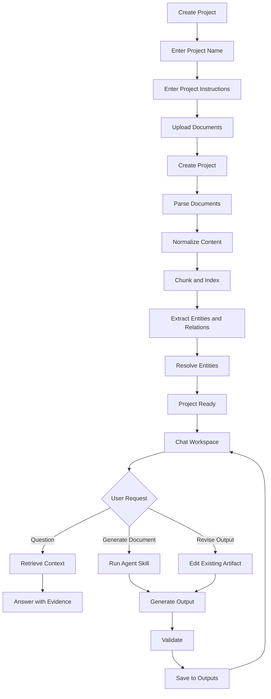
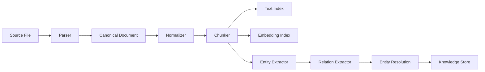
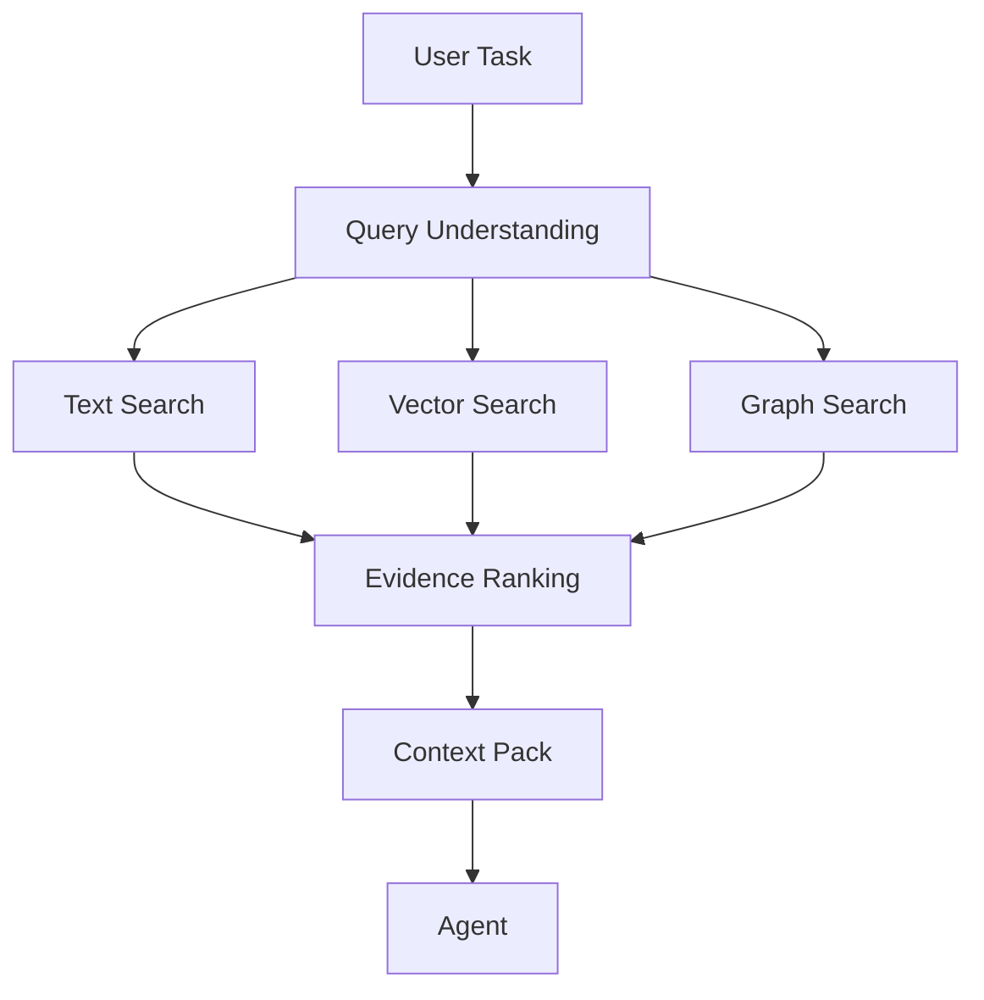
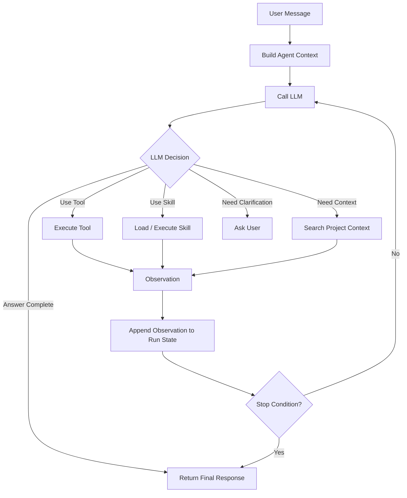
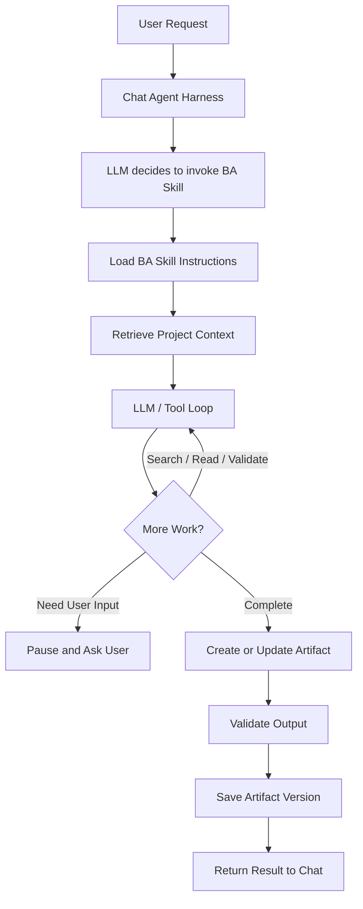
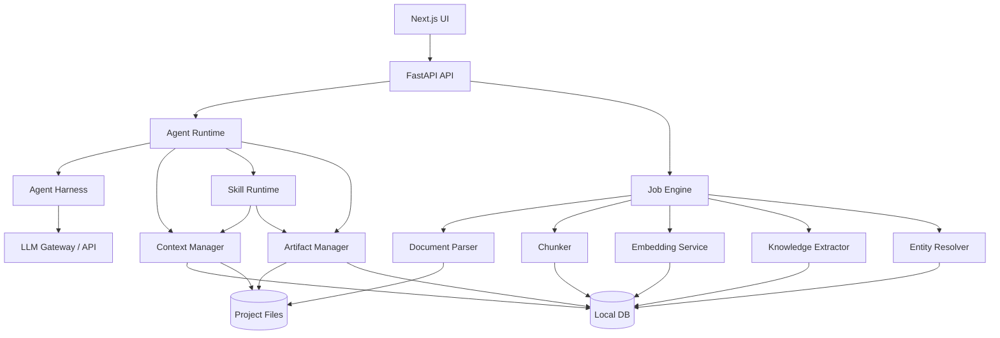

# Local Cowork Knowledge Workspace — System Specification

**Document:** `spec.md`  
**Version:** 1.1  
**Status:** Draft for Implementation  
**Deployment Model:** Local-first, CPU-only  
**Primary UX:** Project workspace with Chat + Project Files + Outputs + Agent Skills  
**Primary Goal:** Allow users to upload project documents, define project instructions, and work through a chat-first Agent Harness that uses configured LLM APIs, project tools, and reusable Agent Skills to generate, revise, validate, and trace documents from project context.

---

## 1. Purpose

Local Cowork Knowledge Workspace is a local AI document workspace inspired by the interaction model of AI coworking tools.

The product is not presented to the user as a Knowledge Graph application. The primary experience is:

1. Create a project.
2. Upload source documents.
3. Define project-level instructions.
4. Let the system understand and index the uploaded context.
5. Chat with an AI agent using that project context.
6. Invoke reusable Agent Skills to create or revise documents.
7. Inspect the evidence used to produce generated content.
8. Continue working in the same project over multiple sessions.

Knowledge Graph, vector search, text search, entity extraction, and document parsing operate as internal context infrastructure behind the agent.

Document ingestion, parsing, indexing, retrieval, and knowledge construction MUST be able to run locally on CPU without GPU. Chat and Agent Skill execution MUST use a configured LLM endpoint. The endpoint MAY be local or remote and MUST support configurable base URL, API key, and model. LiteLLM Gateway compatibility is a first-class requirement.

---

# 2. Product Goals

The system MUST provide the following core capabilities:

- Local project workspaces.
- Drag-and-drop document ingestion.
- Project-specific instructions.
- Local document parsing.
- Incremental document indexing.
- Search across all project context.
- Entity and relation extraction.
- Evidence-backed Knowledge Graph.
- Local embedding generation.
- Chat over project context through an Agent Harness loop.
- Configurable LLM API endpoint, API key, and model.
- First-class LiteLLM Gateway compatibility.
- Optional Claude Agent SDK runtime adapter.
- Reusable Agent Skills.
- Skill-based document generation.
- Skill-based document revision.
- Source traceability.
- Output file management.
- Session history and resumability.
- CPU-only execution.
- Offline-capable document/knowledge processing.
- Local-agent operation when the configured LLM endpoint is also local.

The system SHOULD feel like a normal AI project workspace rather than a technical graph-management tool.

---

# 3. Non-Goals

Version 1 does NOT require:

- General-purpose autonomous desktop control.
- Browser automation.
- Full Microsoft GraphRAG implementation.
- Cloud-hosted vector databases.
- Mandatory Neo4j deployment.
- GPU acceleration.
- Real-time multi-user collaboration.
- Audio/video transcription.
- Advanced diagram topology understanding.
- Automatic execution of arbitrary shell commands.
- Automatic modification of source documents without explicit user action.
- Fully autonomous ontology generation.

These may be added in future phases.

---

# 4. Primary User Experience

The main navigation MUST remain simple.

```text
Projects
  └── Project Workspace
        ├── Chat
        ├── Files
        ├── Outputs
        └── Skills
```

Advanced internals MAY be exposed under:

```text
Advanced
  ├── Knowledge
  ├── Entities
  ├── Relations
  ├── Evidence
  ├── Processing
  └── Settings
```

Users SHOULD NOT need to understand chunks, embeddings, entities, relations, or graph traversal to use the product.

---

# 5. Core User Flow



---

# 6. Project Creation

## 6.1 Create Project Screen

The Create Project screen MUST contain:

- Project name.
- Optional description.
- Project instruction.
- File upload area.
- Create Project button.

Example:

```text
Create Project

Project Name
[ CXGateway Migration                         ]

Project Instruction
┌─────────────────────────────────────────────┐
│ You are a Business Analyst.                 │
│ Use project evidence only.                  │
│ Never invent missing requirements.          │
│ Cite source evidence where possible.        │
└─────────────────────────────────────────────┘

Project Files
┌─────────────────────────────────────────────┐
│ Drop files here                             │
│ PDF DOCX PPTX XLSX CSV MD TXT Images        │
└─────────────────────────────────────────────┘

SRS.docx
architecture.pdf
api.xlsx

                              [ Create Project ]
```

## 6.2 Project Creation Behavior

When the user creates a project, the system MUST:

1. Create the project workspace.
2. Persist project metadata.
3. Copy uploaded files into the project context directory.
4. Create processing jobs for each source.
5. Compute a content hash for every source file.
6. Parse all new files.
7. Normalize parsed content.
8. Build searchable chunks.
9. Generate embeddings where enabled.
10. Extract entities and relations.
11. create/update the project Knowledge Graph.
12. Mark the project as ready when minimum searchable context is available.

The UI MUST allow the user to enter the project before every enrichment stage has completed.

For example, text search MAY become available before graph extraction finishes.

---

# 7. Project Workspace

The default project screen MUST use a two-pane layout.

```text
┌───────────────────────────────────────────────────────────────┐
│ ← Projects       CXGateway Migration                 Settings │
├───────────────────┬───────────────────────────────────────────┤
│ PROJECT           │                                           │
│                   │                  CHAT                     │
│ Context           │                                           │
│  SRS.docx         │ Agent                                     │
│  architecture.pdf │ Project context is ready.                 │
│  api.xlsx         │                                           │
│                   │ 3 files                                   │
│ Outputs           │ 124 chunks                                │
│  requirement.md   │ 38 entities                               │
│  design.md        │                                           │
│                   │ What would you like to do?                │
│ Skills            │                                           │
│  BA   │                                           │
│  API Spec         │                                           │
│  Test Case        │                                           │
│                   ├───────────────────────────────────────────┤
│                   │ Ask about this project...          Send   │
└───────────────────┴───────────────────────────────────────────┘
```

The left pane MUST include:

- Context files.
- Generated outputs.
- Available skills.

The main pane MUST default to Chat.

---

# 8. File Support

Version 1 SHOULD prioritize:

| Format | Handling |
|---|---|
| PDF | Parse text, structure, tables, pages |
| DOCX | Parse headings, paragraphs, tables |
| PPTX | Parse slides, text, tables |
| XLSX | Parse workbook, sheets, cells, tables |
| CSV | Structured table import |
| Markdown | Native structured text |
| TXT | Plain text |
| PNG/JPG/JPEG | OCR when enabled |

The architecture MUST allow additional parsers to be registered later.

Possible future formats include:

- EML
- MSG
- HTML
- EPUB
- ODT
- ODS
- ODP
- RTF
- legacy DOC/XLS/PPT
- audio
- video

---

# 9. Project Filesystem

Each project MUST map to a physical local workspace.

Recommended structure:

```text
projects/
└── <project-id>/
    ├── project.yaml
    │
    ├── context/
    │   ├── source-001.docx
    │   ├── source-002.pdf
    │   └── source-003.xlsx
    │
    ├── parsed/
    │   ├── <document-id>.json
    │   └── ...
    │
    ├── knowledge/
    │   ├── chunks.jsonl
    │   ├── entities.jsonl
    │   ├── relations.jsonl
    │   └── evidence.jsonl
    │
    ├── outputs/
    │   ├── requirement.md
    │   ├── design.md
    │   └── ...
    │
    ├── sessions/
    │   ├── <session-id>.json
    │   └── ...
    │
    ├── tmp/
    │
    └── logs/
```

The database MAY store indexed representations, but project files MUST remain exportable independently from the database.

---

# 10. Document Processing Pipeline

The document processing pipeline MUST be modular.



## 10.1 Parser

Recommended default parser: Docling.

The parser MUST produce a canonical document representation containing where available:

- document identifier.
- file name.
- file type.
- page number.
- section hierarchy.
- heading.
- paragraph.
- table.
- list.
- image reference.
- bounding box.
- reading order.
- source provenance.

## 10.2 Canonical Document

Downstream components MUST NOT depend directly on the original file format.

Example canonical object:

```json
{
  "document_id": "doc_001",
  "source": "SRS.docx",
  "elements": [
    {
      "id": "el_001",
      "type": "heading",
      "level": 1,
      "text": "Authentication"
    },
    {
      "id": "el_002",
      "type": "paragraph",
      "text": "The gateway forwards authentication requests."
    }
  ]
}
```

---

# 11. Incremental Processing

The system MUST NOT reprocess every document whenever a project opens.

Each source MUST have:

- source hash.
- parser version.
- extraction version.
- embedding model version.
- last processed timestamp.

Recommended status:

```text
NEW
PARSING
PARSED
INDEXING
READY
FAILED
STALE
```

If the file hash is unchanged and processing configuration is compatible, the system MUST reuse the existing result.

If the file changes, only the affected source and derived knowledge MUST be rebuilt.

---

# 12. Chunking

Fixed token chunking MUST NOT be the only chunking mechanism.

Chunking SHOULD preserve:

- section hierarchy.
- heading context.
- paragraph boundaries.
- table boundaries.
- slide boundaries.
- page metadata.

Chunk schema:

```json
{
  "chunk_id": "chk_0001",
  "document_id": "doc_001",
  "section_path": [
    "Authentication",
    "Token Validation"
  ],
  "text": "...",
  "page": 4,
  "sequence": 12,
  "source_element_ids": [
    "el_021",
    "el_022"
  ]
}
```

Chunks MUST remain traceable to original source elements.

---

# 13. Knowledge Extraction

Knowledge extraction SHOULD use a staged approach optimized for CPU execution.

```text
Chunk
  ↓
Rule / Dictionary Extraction
  ↓
NER / Lightweight NLP
  ↓
Optional Local LLM Fallback
```

The LLM MUST NOT be required for every chunk.

## 13.1 Entity Types

Default ontology MAY include:

```text
Document
Section
Requirement
System
Service
API
Database
Table
Field
Technology
Person
Organization
Concept
Rule
Decision
ActionItem
```

Projects MAY extend this ontology.

## 13.2 Relation Types

Default relation vocabulary MAY include:

```text
CONTAINS
PART_OF
MENTIONS
REFERENCES
DEPENDS_ON
CALLS
USES
PRODUCES
CONSUMES
IMPLEMENTS
DEFINED_BY
RELATED_TO
DECIDES
REQUIRES
```

---

# 14. Entity Resolution

Entity resolution MUST prevent obvious duplicate graph nodes.

Example aliases:

```text
cxgateway
CX Gateway
CXGateway
cx-gateway
```

may resolve to:

```json
{
  "entity_id": "service:cxgateway",
  "canonical_name": "cxgateway",
  "type": "Service",
  "aliases": [
    "CX Gateway",
    "CXGateway",
    "cx-gateway"
  ]
}
```

Resolution SHOULD run in the following order:

```text
Normalization
  ↓
Exact Alias Match
  ↓
Project Dictionary
  ↓
Fuzzy String Similarity
  ↓
Embedding Similarity
  ↓
Optional LLM Decision
```

Low-confidence merges MUST be reviewable.

---

# 15. Evidence Model

Every knowledge assertion MUST be traceable.

A relation MUST NOT exist only as an unexplained graph edge.

Example:

```json
{
  "relation_id": "rel_001",
  "source_entity_id": "service:cxgateway",
  "relation_type": "CALLS",
  "target_entity_id": "service:cxntlappux",
  "confidence": 0.96,
  "evidence": [
    {
      "document_id": "doc_001",
      "chunk_id": "chk_0042",
      "page": 14,
      "text": "cxgateway forwards authentication requests to cxntlappux."
    }
  ]
}
```

The UI MUST allow users to open evidence from:

- chat answers.
- generated documents.
- entity details.
- relation details.

---

# 16. Knowledge Storage

Version 1 SHOULD use a lightweight local database.

Recommended default:

```text
DuckDB
```

Alternative local implementations MAY use SQLite where appropriate.

The core persistence model MUST support:

```text
projects
documents
document_versions
chunks
entities
entity_aliases
relations
relation_evidence
embeddings
processing_jobs
sessions
messages
skill_runs
artifacts
artifact_versions
```

Graph persistence SHOULD initially use relational Node/Edge tables rather than require a dedicated graph server.

---

# 17. Search Architecture

The system SHOULD provide hybrid retrieval.



Retrieval sources:

### Text Search

Used for:

- exact names.
- API routes.
- IDs.
- requirements.
- error messages.
- technical terms.

### Vector Search

Used for:

- semantic similarity.
- concept lookup.
- related sections.
- ambiguous natural-language questions.

### Graph Search

Used for:

- dependencies.
- references.
- connected systems.
- relationships.
- multi-hop context.

The system SHOULD merge results into a ranked Context Pack.

---

# 18. Context Manager

The Context Manager is responsible for preventing the system from sending an entire project to the LLM.

Inputs:

```text
User message
Project instruction
Selected files
Selected skill
Conversation state
```

Outputs:

```text
Relevant chunks
Relevant entities
Relevant relations
Evidence
Relevant output artifacts
```

Context Pack example:

```json
{
  "task": "Create authentication requirements",
  "sources": [
    {
      "document": "SRS.docx",
      "chunks": ["chk_01", "chk_02"]
    },
    {
      "document": "architecture.pdf",
      "chunks": ["chk_14"]
    }
  ],
  "entities": [
    "service:cxgateway",
    "service:cxntlappux",
    "technology:redis"
  ],
  "relations": [
    "rel_001",
    "rel_004"
  ]
}
```

The Context Manager MUST enforce configurable context limits.

---

# 19. Chat Agent Harness

Chat is the primary execution surface of the product. Every user message MUST enter the Agent Harness before any skill, tool, retrieval operation, or artifact write is performed.

The Agent Harness coordinates:

```text
User
  ↓
Chat UI
  ↓
Agent Harness
  ├── LLM Gateway Client
  ├── Context Manager
  ├── Skill Registry
  ├── Tool Runtime
  ├── Permission / Approval Gate
  ├── Validator
  ├── Artifact Manager
  └── Session / Run State
```

The harness MUST support at least these request classes:

```text
QUESTION
SEARCH
SUMMARIZE
RUN_SKILL
GENERATE_ARTIFACT
REVISE_ARTIFACT
VALIDATE_ARTIFACT
CLARIFY
```

The agent SHOULD identify an appropriate skill automatically. The user MUST also be able to explicitly select or invoke a skill.

## 19.1 Harness Loop

The default execution model MUST be an iterative agent loop rather than a single prompt-response call.



Conceptually:

```text
while not finished:
    context = build_context(run_state)
    decision = llm(context)

    if decision.tool_call:
        observation = execute_tool(decision.tool_call)
        run_state.append(observation)
        continue

    if decision.skill_call:
        observation = execute_skill(decision.skill_call)
        run_state.append(observation)
        continue

    if decision.needs_clarification:
        pause_run_and_ask_user()
        break

    return final_response
```

The harness MUST implement stop controls:

```text
max_iterations
max_tool_calls
max_skill_calls
max_context_tokens
run_timeout
user_cancel
explicit_finish
```

The harness MUST persist enough run state to resume an interrupted skill or chat execution where technically possible.

## 19.2 Harness Implementation Modes

The core application MUST expose a runtime interface so the harness implementation is replaceable.

```text
AgentHarness
  ├── NativeHarness               REQUIRED
  └── ClaudeAgentSDKHarness       OPTIONAL
```

### NativeHarness

`NativeHarness` is the default and provider-neutral implementation. It MUST work with the configured LLM API through the LLM Gateway Client and MUST NOT require Anthropic-specific APIs.

This is the REQUIRED path for LiteLLM Gateway deployments.

### ClaudeAgentSDKHarness

The system MAY provide an adapter using the current Claude Agent SDK (formerly Claude Code SDK).

This adapter MAY reuse the SDK's built-in agent loop, tool execution, session handling, and permission model where compatible with the configured provider.

The core domain model, Project Context, Skills, Artifacts, and Evidence MUST remain independent of Claude Agent SDK so the application can switch back to `NativeHarness` without migrating project data.

## 19.3 Agent Run State

Each agent execution SHOULD persist:

```text
run_id
session_id
project_id
user_message_id
harness_type
llm_profile_id
selected_skill
status
iteration_count
tool_call_count
skill_call_count
started_at
updated_at
completed_at
error_code
```

Run statuses:

```text
PENDING
RUNNING
WAITING_USER
SUCCEEDED
FAILED
CANCELLED
```

---

# 20. Agent Tools

The initial tool set SHOULD include:

```text
list_project_files
read_document
search_project
search_chunks
find_entity
query_graph
get_evidence
read_artifact
write_artifact
update_artifact
list_outputs
run_validator
```

Tools MUST enforce the current project boundary.

A project agent MUST NOT read files belonging to another project unless explicitly enabled by future cross-project functionality.

---

# 21. Agent Skills

A Skill is a reusable task package that the Chat Agent can discover and execute inside the harness loop. Skills are not independent chatbots. They extend the capabilities of the project agent.

Skills MUST be installable independently from the core application.

Recommended structure:

```text
skills/
├── default/
│   └── ba/
│       ├── SKILL.md
│       ├── workflow.yaml
│       ├── prompt.md
│       ├── schema.json
│       ├── templates/
│       ├── validators/
│       └── scripts/
└── installed/
```

## 21.1 Default BA Skill

A `ba` skill MUST be installed with every application installation and enabled by default for newly created projects.

The default BA skill MUST NOT require a separate download or marketplace installation.

Initial BA capabilities SHOULD include:

```text
Analyze uploaded project context
Summarize business context
Identify goals / actors / systems / dependencies
Identify ambiguities and conflicting evidence
Generate requirement documents
Generate structured functional requirements
Generate non-functional requirements from supported evidence
Generate user stories when requested
Generate clarification questions
Revise existing BA artifacts
Validate generated requirements against evidence
```

Recommended explicit invocation:

```text
/ba <instruction>
```

Natural-language invocation MUST also work, for example:

```text
สร้าง requirement จาก context ทั้งหมด
ช่วย BA วิเคราะห์เอกสารชุดนี้
สร้าง user story จาก requirement.md
```

## 21.2 Skill Manifest

Example default BA manifest:

```yaml
id: ba
name: Business Analyst
version: 1.0.0
builtin: true
enabled_by_default: true

description: >
  Analyze project evidence and generate evidence-backed
  BA artifacts such as requirements and user stories.

inputs:
  - project_context
  - user_instruction
  - selected_files
  - current_artifact

outputs:
  - markdown_artifact

tools:
  - list_project_files
  - search_project
  - search_chunks
  - read_document
  - query_graph
  - get_evidence
  - read_artifact
  - write_artifact
  - update_artifact
  - run_validator

rules:
  - never_invent_missing_information
  - prefer_project_terminology
  - cite_evidence_for_critical_claims
  - identify_conflicts
  - preserve_user_edits
```

## 21.3 Skill Workflow

Example BA workflow:

```yaml
steps:
  - understand_task
  - collect_context
  - analyze_sources
  - identify_requirements
  - identify_gaps_and_conflicts
  - generate_or_patch_artifact
  - validate_evidence
  - validate_structure
  - write_output
```

A skill step MAY be:

```text
LLM reasoning step
Tool call
Retrieval step
Deterministic script
Validator
Artifact write
Human approval / clarification
```

Skills MUST execute under the parent Agent Harness run and MUST NOT bypass project isolation or tool permissions.

---

# 22. Skill Execution

Example user request:

```text
สร้าง requirement จาก context ทั้งหมด
```

Execution MUST remain inside the Chat Agent Harness:



The Skill Runtime MUST return observations/results to the parent harness rather than directly completing the user session. This allows the harness to decide whether another tool, another skill, validation, or a final answer is required.

The chat result SHOULD contain:

```text
BA task completed

Sources used:
- SRS.docx
- architecture.pdf
- api.xlsx

Output:
requirement.md
```

The UI SHOULD provide actions:

```text
Open
Revise
Validate
View Evidence
Download
```

---

# 23. Artifact Generation

Generated documents MUST be treated as managed artifacts.

Artifact metadata SHOULD include:

```text
artifact_id
project_id
file_name
type
skill_id
skill_version
created_at
updated_at
source_context
version
validation_status
```

The system MUST support artifact versioning.

Example:

```text
requirement.md
  v1
  v2
  v3
```

The user MUST be able to revise an existing artifact through chat.

Example:

```text
เพิ่ม NFR latency <= 2 seconds
```

The agent SHOULD modify the existing artifact rather than regenerate unrelated sections.

---

# 24. Source Referencing in Generated Documents

Where supported by the selected output template, generated content SHOULD retain machine-readable source references.

Example internal representation:

```json
{
  "requirement_id": "REQ-001",
  "text": "The gateway shall forward authentication requests.",
  "evidence": [
    {
      "document_id": "doc_001",
      "page": 4,
      "chunk_id": "chk_014"
    }
  ]
}
```

The visible document MAY render citations differently depending on the template.

---

# 25. Chat

Chat MUST preserve project scope.

Each conversation message SHOULD contain:

```text
message_id
session_id
project_id
role
content
created_at
selected_files
skill_id
tool_calls
artifact_refs
evidence_refs
```

The user SHOULD be able to reference files directly:

```text
@SRS.docx
@architecture.pdf
```

Examples:

```text
@SRS.docx สรุป authentication flow
```

```text
ใช้ @architecture.pdf กับ @api.xlsx สร้าง API design
```

The agent MUST prioritize explicitly referenced files while still respecting project instructions.

---

# 26. Chat Session History

The system MUST preserve previous project sessions.

Users SHOULD be able to:

- create a new chat.
- reopen a previous chat.
- continue a previous chat.
- rename a chat.
- delete a chat.

Chat history MUST NOT be the sole long-term memory mechanism.

Project files, artifacts, knowledge index, project instructions, and user-approved knowledge persist independently of chat history.

---

# 27. Project Instruction

Instruction precedence SHOULD be:

```text
System Safety / Runtime Rules
        ↓
Global Workspace Instruction
        ↓
Project Instruction
        ↓
Skill Instruction
        ↓
Current User Instruction
```

Lower levels MAY specialize higher-level instructions but MUST NOT bypass platform security restrictions.

Project instruction examples:

```text
Use formal technical language.
Do not invent unsupported facts.
Prefer existing terminology in uploaded documents.
Identify conflicting information.
Include evidence for every important requirement.
```

---

# 28. Processing Status UI

Document processing MUST be visible without overwhelming the user.

Example:

```text
SRS.docx
✓ Parsed
✓ Indexed
✓ Knowledge extracted

architecture.pdf
✓ Parsed
→ Extracting knowledge

scan.pdf
→ OCR 62%
```

Detailed logs SHOULD only appear when requested.

---

# 29. Review Queue

The system SHOULD avoid forcing the user to review every extracted item.

Only uncertain items SHOULD appear in a Review Queue.

Examples:

```text
Possible duplicate entities
Low-confidence relations
Conflicting facts
Unresolved aliases
Parser warnings
```

Example:

```text
CX Gateway
cx-gateway
CXGateway

Suggested:
Merge as "cxgateway"

[ Merge ] [ Keep Separate ]
```

---

# 30. Knowledge Explorer

Knowledge Graph visualization is an advanced feature.

Example:

```text
Search: Redis

cxgateway
    |
   CALLS
    ↓
cxntlappux
    |
   USES
    ↓
Redis
```

Selecting a node SHOULD display:

```text
Canonical Name
Entity Type
Aliases
Connected Entities
Documents
Evidence
```

Selecting an edge SHOULD display source evidence.

The Graph UI is NOT the primary workflow.

---

# 31. CPU-Only Requirements

Document processing and knowledge infrastructure MUST work without GPU.

The following MUST support CPU execution:

```text
Document parsing
OCR
Chunking
Text indexing
Embedding generation
Knowledge extraction baseline
Entity resolution baseline
Graph storage / traversal
```

The architecture SHOULD reduce CPU cost through:

- incremental processing.
- deterministic parsing.
- rule-based entity extraction.
- dictionary matching.
- lightweight NLP.
- embedding caching.
- batched embedding.
- context retrieval before LLM generation.

The system MUST NOT require a large generative model to build the basic project index.

Chat and Agent Skill execution REQUIRE an LLM endpoint, but that endpoint MAY be:

```text
Local model server on the same machine
Local model server on another machine
LiteLLM Gateway
Remote OpenAI-compatible endpoint
Direct supported provider adapter
```

Therefore `CPU-only` refers to the local workspace/document stack and does not prohibit using a remote LLM API.

---

# 32. LLM Gateway and Provider Layer

The Chat Agent MUST call LLMs through a provider abstraction.

The primary V1 integration MUST be an OpenAI-compatible client capable of connecting to LiteLLM Gateway.

```text
Agent Harness
     ↓
LLMGatewayClient
     │
     ├── OpenAICompatibleProvider   REQUIRED
     │       ├── LiteLLM Gateway
     │       ├── local compatible gateway
     │       └── remote compatible gateway
     │
     ├── AnthropicProvider          OPTIONAL
     └── future provider adapters
```

## 32.1 LLM Profile

The system MUST support one or more named LLM profiles.

Example:

```yaml
id: company-gateway
type: openai-compatible
base_url: https://llm-gateway.example.com/v1
api_key_ref: secret://llm/company-gateway
model: claude-sonnet
timeout_seconds: 120
max_output_tokens: 8192
```

Required configuration fields:

```text
Provider Type
Base URL / Endpoint
API Key
Model
Request Timeout
```

Optional fields:

```text
Custom Headers
Organization / Tenant Header
Max Output Tokens
Context Window Override
Retry Count
TLS Verification
Proxy
Extra Request Parameters
Tool Calling Mode: auto | native | prompt-json
Streaming Enabled
```

The provider layer SHOULD perform a capability check or use configured capability overrides for:

```text
streaming
tool calling
maximum context
maximum output tokens
```

`native` tool calling is preferred. `prompt-json` MAY be used as a compatibility fallback for models/gateways that do not expose native function/tool calls. The fallback MUST validate the action schema before executing any tool.

API keys MUST be stored in a secret store or protected application configuration and MUST NOT be written into project files, exported project packages, chat history, or logs.

## 32.2 LiteLLM Gateway Compatibility

LiteLLM Gateway compatibility is a V1 requirement.

The application MUST allow configuration similar to:

```text
Endpoint: http://llm-gateway.local:4000/v1
API Key: <virtual-key-or-gateway-key>
Model: <gateway-model-alias>
```

The application MUST NOT assume the upstream vendor based on the model name. The gateway owns provider routing.

At minimum the client SHOULD support:

```text
chat completions
streaming
tool/function calls
model selection
timeout
retryable errors
authentication errors
rate-limit errors
```

Where supported, the application MAY add Responses API support without making it mandatory for the initial implementation.

## 32.3 LLM Client Interface

Recommended interface:

```text
complete(messages, tools, options)
stream(messages, tools, options)
count_tokens(messages)        optional
health()
list_models()                 optional
model_info(model)             optional
```

Embedding MUST remain a separate interface and MUST NOT be coupled to the chat model.

## 32.4 Claude Agent SDK Adapter

The system MAY implement `ClaudeAgentSDKHarness` using the current Claude Agent SDK, formerly known as the Claude Code SDK.

```text
Chat UI
  ↓
ClaudeAgentSDKHarness
  ↓
Claude Agent SDK
  ├── Agent loop
  ├── Tool execution
  ├── Session handling
  └── Permission callbacks
```

The adapter MUST map project-scoped tools and skills into the SDK without granting unrestricted filesystem access.

The adapter is OPTIONAL. `NativeHarness + OpenAICompatibleProvider` remains the canonical V1 implementation because it preserves LiteLLM and provider neutrality.

---

# 33. Embedding Layer

Embedding SHOULD run independently from the generative LLM.

Recommended interface:

```text
EmbeddingProvider
  ├── sentence-transformers CPU
  └── future compatible providers
```

Embeddings MUST be cached.

Re-embedding MUST occur only when:

- source content changed.
- chunking changed.
- embedding model changed.
- embedding configuration changed.

---

# 34. OCR

OCR SHOULD be disabled for documents that already contain usable text.

OCR SHOULD activate when:

```text
image source
or
scanned PDF
or
low extracted text density
```

The OCR engine MUST be configurable.

OCR output MUST preserve source-page references where possible.

---

# 35. API Architecture

Recommended backend:

```text
FastAPI
```

Recommended frontend:

```text
Next.js
```

Recommended high-level API namespaces:

```text
/api/projects
/api/files
/api/chat
/api/search
/api/knowledge
/api/skills
/api/artifacts
/api/jobs
/api/settings
```

---

# 36. Representative API Contracts

## Create Project

```http
POST /api/projects
```

Request:

```json
{
  "name": "CXGateway Migration",
  "description": "",
  "instruction": "Use uploaded evidence only."
}
```

Response:

```json
{
  "project_id": "prj_001",
  "name": "CXGateway Migration",
  "status": "ACTIVE"
}
```

---

## Upload Project Files

```http
POST /api/projects/{project_id}/files
```

Multipart upload.

Response:

```json
{
  "files": [
    {
      "file_id": "file_001",
      "name": "SRS.docx",
      "status": "NEW"
    }
  ]
}
```

---

## Create / Update LLM Profile

```http
PUT /api/settings/llm-profiles/{profile_id}
```

Request:

```json
{
  "type": "openai-compatible",
  "base_url": "http://llm-gateway.local:4000/v1",
  "api_key": "<secret>",
  "model": "company-agent-model",
  "timeout_seconds": 120,
  "tool_calling_mode": "auto"
}
```

API keys MUST be accepted as write-only secrets. Read APIs MUST return only masked metadata, never the original secret.

## Test LLM Profile

```http
POST /api/settings/llm-profiles/{profile_id}/test
```

The response SHOULD report:

```text
reachable
authentication valid / invalid
model callable
streaming capability if tested
tool-calling capability if tested
latency
error category
```

---

## Send Chat Message

```http
POST /api/projects/{project_id}/chat
```

Request:

```json
{
  "session_id": "session_001",
  "message": "สร้าง requirement จาก context ทั้งหมด",
  "selected_files": [],
  "skill_id": null,
  "llm_profile_id": null,
  "harness": "native"
}
```

Response MUST support streaming status/events. The UI MUST display operational progress without exposing private chain-of-thought.

Recommended event types:

```text
run.started
assistant.delta
context.search.started
context.search.completed
tool.started
tool.completed
skill.started
skill.completed
artifact.created
artifact.updated
validation.completed
run.waiting_user
run.completed
run.failed
```

Events MAY contain concise status text such as `Searching project context` or `Running BA validation`, but MUST NOT expose hidden reasoning traces.

---

## Run Skill

```http
POST /api/projects/{project_id}/skills/{skill_id}/run
```

Request:

```json
{
  "instruction": "Generate authentication requirements",
  "selected_files": [
    "file_001",
    "file_002"
  ]
}
```

---

## Search Project

```http
POST /api/projects/{project_id}/search
```

Request:

```json
{
  "query": "authentication token validation",
  "mode": "hybrid",
  "limit": 20
}
```

---

# 37. Job System

Expensive processing MUST run through a job abstraction.

Job types MAY include:

```text
PARSE_DOCUMENT
OCR_DOCUMENT
CHUNK_DOCUMENT
EMBED_DOCUMENT
EXTRACT_ENTITIES
EXTRACT_RELATIONS
RESOLVE_ENTITIES
BUILD_KNOWLEDGE
RUN_SKILL
VALIDATE_ARTIFACT
```

Job states:

```text
PENDING
RUNNING
SUCCEEDED
FAILED
CANCELLED
```

Version 1 MAY implement the queue using the local database rather than requiring Redis/RabbitMQ.

---

# 38. Concurrency

CPU-only execution MUST avoid saturating the machine.

Settings SHOULD include:

```text
max_parse_workers
max_embedding_workers
max_llm_jobs
max_ocr_workers
```

Default behavior SHOULD prioritize interactive chat over background enrichment.

For example:

```text
Interactive chat         highest priority
User-triggered skill     high priority
Document parsing         medium priority
Graph enrichment         low priority
Background reindex       lowest priority
```

---

# 39. Security

The system is local-first, but MUST still enforce basic security controls.

Requirements:

- sanitize file paths.
- prevent directory traversal.
- isolate projects.
- validate uploaded file type.
- enforce configurable upload size.
- do not execute uploaded documents.
- sanitize rendered HTML.
- restrict skill tool permissions.
- prevent arbitrary filesystem access from skills.
- keep credentials outside project files.
- encrypt or protect stored LLM API keys using the platform-appropriate secret mechanism.
- never expose LLM API keys to Agent Skills or generated artifacts unless explicitly required by a future privileged integration.
- mask secrets in logs where practical.

Skills MUST declare required tools and permissions.

---

# 40. Local and Offline Operation

Document parsing, OCR, chunking, indexing, embeddings, Knowledge Graph construction, project storage, and artifact management MUST be capable of local execution without cloud services.

Chat / Agent execution requires a configured LLM endpoint.

A fully offline deployment is achieved when that endpoint is also local, for example:

```text
Local Workspace
      ↓
Local LiteLLM / compatible Gateway
      ↓
Local LLM Runtime
```

A deployment MAY instead use a remote LiteLLM Gateway or remote provider. In that case the UI MUST clearly identify that agent prompts/context may leave the local machine according to the configured endpoint.

---

# 41. Settings

Global settings SHOULD include:

```text
Workspace Root
Parser Configuration
OCR Configuration
Embedding Model

Agent Harness
  - Native
  - Claude Agent SDK (optional)

LLM Profiles
  - Provider Type
  - Endpoint / Base URL
  - API Key
  - Model
  - Custom Headers
  - Timeout
  - Retry
  - Context Limit / Override

Default LLM Profile
CPU Worker Limits
Skill Directory
Default Global Instruction
Logging Level
```

Project settings SHOULD include:

```text
Project Name
Project Description
Project Instruction
Enabled Skills
Ontology Extension
Extraction Rules
```

The Settings UI MUST allow users to:

```text
Create LLM Profile
Edit Endpoint / Base URL
Enter or replace API Key
Select / type Model Alias
Test Connection
Set Default Profile
Select Agent Harness
Configure tool-calling mode
```

For LiteLLM, model names MUST be treated as gateway aliases and MUST NOT be rewritten by the client.

---

# 42. Observability

The system SHOULD log structured events.

Minimum events:

```text
project.created
file.uploaded
document.parsed
document.failed
index.updated
entity.created
relation.created
skill.started
skill.completed
skill.failed
artifact.created
artifact.updated
chat.request
chat.error
agent.run.started
agent.run.waiting_user
agent.run.completed
agent.run.failed
agent.tool.called
agent.skill.called
llm.request
llm.error
```

Logs MUST NOT store full sensitive document content by default. LLM prompts, tool arguments, retrieved chunks, and model responses MUST be metadata-only in logs unless an explicit debug setting is enabled. API keys MUST never be logged.

---

# 43. Error Handling

User-facing errors MUST be actionable.

Bad:

```text
Processing failed.
```

Good:

```text
architecture.pdf could not be parsed.

Reason:
The PDF contains scanned pages and OCR is disabled.

Actions:
[ Enable OCR ]
[ Retry ]
```

Failed processing of one document MUST NOT make the entire project unusable.

---

# 44. Resumability

All long-running operations MUST be resumable where technically possible.

If the application stops during:

```text
document parsing
embedding
knowledge extraction
skill generation
```

the system SHOULD continue from completed checkpoints rather than restart the entire project.

---

# 45. Output Templates

Skills SHOULD support output templates.

Example:

```text
skills/
└── ba-requirement/
    └── templates/
        ├── requirement.template.md
        └── requirement.template.docx
```

A skill MUST be able to specify:

```text
output_format
output_template
required_sections
validation_schema
```

Version 1 SHOULD prioritize Markdown output.

DOCX generation MAY be provided by a specialized document-generation skill.

---

# 46. Validation

Artifact validation MUST be separate from generation.

Possible validation types:

```text
Schema Validation
Required Section Validation
Source Evidence Validation
Broken Reference Validation
Terminology Validation
Custom Skill Validation
```

Example:

```text
Generated: requirement.md

Validation
✓ Required sections present
✓ All requirement IDs unique
✓ All cited evidence exists
! 2 requirements have low evidence confidence
```

---

# 47. Conflict Detection

When different sources disagree, the system MUST NOT silently merge conflicting facts.

Example:

```text
SRS.docx:
Token expires after 30 minutes.

API.pdf:
Token expires after 60 minutes.
```

The knowledge layer SHOULD create a conflict record.

The agent SHOULD report:

```text
Conflict detected:
- SRS.docx: 30 minutes
- API.pdf: 60 minutes
```

A skill MAY request user clarification before finalizing affected content.

---

# 48. Suggested Technology Stack

| Layer | Default |
|---|---|
| Frontend | Next.js |
| Backend | FastAPI |
| Document parsing | Docling |
| OCR | Configurable local OCR |
| Local DB | DuckDB |
| Text search | DuckDB/FTS or local search component |
| Embeddings | SentenceTransformers CPU |
| Graph | Node/Edge relational tables |
| Graph UI | Cytoscape.js |
| Agent Harness | Native Harness; optional Claude Agent SDK adapter |
| LLM Gateway Client | OpenAI-compatible API; LiteLLM Gateway first-class |
| LLM Runtime | External/local endpoint selected by configured LLM profile |
| Skill definition | Markdown + YAML + JSON Schema |
| Deployment | Docker Compose or native local process |

Technology choices MUST remain replaceable behind interfaces where practical.

---

# 49. Internal Component Architecture



---

# 50. Suggested Backend Modules

```text
backend/
├── api/
│   ├── projects.py
│   ├── files.py
│   ├── chat.py
│   ├── search.py
│   ├── skills.py
│   ├── artifacts.py
│   └── jobs.py
│
├── agent/
│   ├── service.py
│   ├── run_state.py
│   ├── context.py
│   ├── harness/
│   │   ├── base.py
│   │   ├── native.py
│   │   └── claude_agent_sdk.py
│   └── tools/
│
├── skills/
│   ├── loader.py
│   ├── runtime.py
│   └── validator.py
│
├── documents/
│   ├── parser.py
│   ├── normalizer.py
│   └── chunker.py
│
├── knowledge/
│   ├── entities.py
│   ├── relations.py
│   ├── resolver.py
│   ├── graph.py
│   └── evidence.py
│
├── retrieval/
│   ├── text_search.py
│   ├── vector_search.py
│   ├── graph_search.py
│   └── ranker.py
│
├── artifacts/
│   ├── manager.py
│   └── versions.py
│
├── providers/
│   ├── llm/
│   │   ├── base.py
│   │   ├── openai_compatible.py
│   │   └── anthropic.py
│   └── embedding/
│
├── secrets/
│   └── store.py
│
├── jobs/
│   ├── worker.py
│   └── queue.py
│
└── storage/
    ├── db.py
    └── filesystem.py
```

---

# 51. Suggested Frontend Routes

```text
/
  Projects

/projects/new
  Create Project

/projects/{projectId}
  Project Chat Workspace

/projects/{projectId}/files
  Project Files

/projects/{projectId}/outputs
  Generated Outputs

/projects/{projectId}/skills
  Skills

/projects/{projectId}/knowledge
  Advanced Knowledge Explorer

/projects/{projectId}/processing
  Processing Status

/settings
  Global Settings
```

The default route for a project MUST be the Chat Workspace.

---

# 52. V1 UI Screens

V1 SHOULD implement:

```text
1. Projects
2. Create Project
3. Project Chat Workspace
4. File Preview
5. Artifact Viewer / Editor
6. Skills
7. Processing Status
8. Settings
```

Knowledge Graph visualization MAY be included in V1 if capacity permits, but MUST NOT block the core release.

---

# 53. Project Dashboard Behavior

Opening a project SHOULD immediately communicate:

```text
Project status
Context readiness
Processing issues
Recent outputs
Recent chats
```

Example:

```text
CXGateway Migration

Context
3 documents ready
1 document processing

Knowledge
38 entities
72 relations

Outputs
requirement.md
design.md

Recent
Authentication requirements
API design review
```

---

# 54. Skill Selection UX

Users MAY invoke skills in three ways:

```text
Automatic:
"สร้าง requirement จากเอกสารทั้งหมด"

Explicit:
"/ba-requirement authentication"

UI:
Skills → BA → Run
```

The system SHOULD show which skill is running.

Example:

```text
Running:
BA Generator

Step 3/6
Analyzing evidence...
```

The system SHOULD expose concise progress, not raw chain-of-thought.

---

# 55. Agent Behavior Requirements

The agent MUST:

- operate only within allowed project context.
- prefer evidence-backed answers.
- identify uncertainty.
- identify conflicting sources.
- avoid fabricating missing project facts.
- cite evidence when appropriate.
- use relevant skills for structured generation.
- preserve user-edited artifact content when making targeted revisions.
- avoid rewriting unrelated sections unnecessarily.
- save generated outputs into the project outputs directory.

The agent SHOULD:

- search before asking the user to repeat information already present in the project.
- use deterministic tools instead of LLM reasoning when a tool can answer reliably.
- minimize context sent to the LLM.
- reuse prior processing results.

---

# 56. Knowledge Health

The system MAY expose a lightweight project health indicator.

It SHOULD NOT pretend that graph completeness can be measured exactly.

Possible indicators:

```text
Documents processed
Parser failures
Unresolved entities
Low-confidence relations
Conflicts
Stale documents
```

Example:

```text
Context Health

Documents ready       12 / 12
Parser failures        0
Unresolved aliases     3
Conflicts              2
Stale documents        0
```

---

# 57. Performance Targets

Exact performance depends on CPU and document complexity.

V1 SHOULD target the following behavioral requirements rather than fixed universal timing:

- Chat UI remains responsive while indexing runs.
- Parsing jobs do not block the web server.
- Multiple unchanged project files are not reprocessed.
- Embeddings are generated incrementally.
- Only relevant context is passed to the LLM.
- Background extraction can be paused.
- The user can cancel long-running jobs.
- Large project ingestion can continue across restarts.

---

# 58. Scalability Target

Initial design SHOULD support projects roughly in the range of:

```text
1–500 documents
thousands to hundreds of thousands of chunks
thousands to hundreds of thousands of entities/relations
```

Exact upper bounds depend on host CPU, memory, file size, embedding dimension, and model selection.

The architecture MUST avoid assumptions that require loading the entire graph or all embeddings into memory.

---

# 59. Backup and Portability

A project SHOULD be exportable as:

```text
project-package.zip
```

Containing at minimum:

```text
project metadata
context files
outputs
project instructions
skill references
optional parsed/index metadata
```

The project MUST remain restorable even if derived indexes need to be rebuilt.

Source documents and generated outputs are authoritative persisted assets.

Indexes are rebuildable derived data.

---

# 60. Deletion Semantics

Deleting a source document MUST also invalidate or remove:

```text
its chunks
its embeddings
its extracted entity evidence
its relation evidence
knowledge assertions supported only by that source
```

Entities or relations supported by other documents MUST remain.

Deleting an output artifact MUST NOT delete source knowledge.

---

# 61. Versioning

The system SHOULD version:

```text
documents
artifacts
skills
parser configuration
embedding model
ontology
extraction rules
```

This allows the system to determine when derived data is stale.

---

# 62. Extensibility

The architecture MUST allow future plugins for:

```text
Git
GitLab
Jira
Figma
Confluence
Google Drive
SharePoint
custom MCP services
database connectors
API catalogs
```

External connectors SHOULD normalize retrieved data into the same project context model.

The core agent SHOULD not require connector-specific retrieval logic.

---

# 63. Future Phase: Diagram Understanding

A future diagram-processing component MAY extract:

```text
nodes
labels
arrows
connections
groups
flow direction
```

Example:

```text
Mobile App
   ↓
Gateway
   ↓
App Service
```

could produce:

```text
Mobile App --CALLS--> Gateway
Gateway --CALLS--> App Service
```

This MUST remain separate from ordinary OCR.

---

# 64. Future Phase: GraphRAG

Full GraphRAG MAY be introduced when:

```text
projects become large
cross-document reasoning becomes important
community-level summaries provide measurable benefit
sufficient CPU resources are available
```

It is not a prerequisite for the core system.

---

# 65. V1 Functional Requirements

## FR-001 — Create Project

The user MUST be able to create a project with:

```text
name
description
instruction
initial documents
```

## FR-002 — Upload Documents

The user MUST be able to add files after project creation.

## FR-003 — Parse Documents

The system MUST parse supported documents locally.

## FR-004 — Incremental Index

The system MUST avoid reprocessing unchanged documents.

## FR-005 — Project Search

The user and agent MUST be able to search project context.

## FR-006 — Chat Agent Harness

The user MUST be able to chat with an agent scoped to the project. Each chat turn MUST run through the configured Agent Harness and support iterative tool/skill execution.

## FR-007 — File Reference

The user SHOULD be able to reference a project file in chat.

## FR-008 — Skill Execution

The agent MUST be able to discover and execute installed skills inside the harness loop. The built-in `ba` skill MUST be installed and enabled by default.

## FR-009 — Generate Artifact

A skill MUST be able to create a file inside project outputs.

## FR-010 — Revise Artifact

The agent MUST be able to revise an existing generated artifact.

## FR-011 — Evidence

The system MUST retain source evidence for retrieved project knowledge.

## FR-012 — Session Persistence

Chat sessions MUST survive application restart.

## FR-013 — Job Persistence

Long-running processing state SHOULD survive restart.

## FR-014 — Local Processing

Document processing, indexing, retrieval, and project storage MUST function without internet access after dependencies/models are installed. Chat MUST function offline when the configured LLM endpoint is local.

## FR-015 — CPU Execution

All local document/knowledge processing required by Core V1 MUST function without GPU.

## FR-016 — Configurable LLM Gateway

The user MUST be able to configure endpoint/base URL, API key, and model. OpenAI-compatible LiteLLM Gateway access MUST be supported.

## FR-017 — Agent Harness Loop

The Chat Agent MUST support iterative LLM → tool/skill → observation → LLM execution with configurable stop limits and cancellation.

## FR-018 — Default BA Skill

The `ba` skill MUST ship with the application, be enabled by default for new projects, and support evidence-backed requirement generation and revision.

---

# 66. V1 Non-Functional Requirements

## NFR-001 — Privacy

Project files MUST stay local unless the user explicitly configures an external model/provider.

## NFR-002 — Traceability

Knowledge assertions SHOULD be traceable to source evidence.

## NFR-003 — Recoverability

Derived indexes MUST be rebuildable from project source files.

## NFR-004 — Modularity

Parser, LLM, embeddings, skills, and storage MUST be replaceable through interfaces.

## NFR-005 — Responsiveness

Background indexing MUST NOT freeze the UI.

## NFR-006 — Isolation

One project's context MUST NOT leak into another project's responses.

## NFR-007 — Determinism

Deterministic parsing/rules SHOULD be preferred over LLM inference when sufficient.

## NFR-008 — Explainability

The system SHOULD expose which project sources support an answer or generated artifact.

---

# 67. V1 Acceptance Criteria

The V1 release is accepted when all of the following can be demonstrated.

### Scenario A — Create Project

Given a fresh installation,
when a user creates a project,
uploads a DOCX, PDF, and XLSX,
and supplies project instructions,
then the project is created and the uploaded files appear under Context.

### Scenario B — Local Processing

Given uploaded project files,
when indexing starts,
then parsing and indexing complete without using a GPU or mandatory cloud API.

### Scenario C — Ask Project Question

Given indexed project documents,
when the user asks a factual question,
then the agent retrieves relevant project evidence and produces a scoped answer.

### Scenario D — Run Default BA Skill

Given a new project with the built-in `ba` skill enabled by default,
when the user requests:

```text
สร้าง requirement จาก context ทั้งหมด
```

then the Agent Harness:

```text
automatically selects the built-in ba skill
retrieves project evidence through project-scoped tools
iterates through the LLM/tool/skill loop as required
generates requirement.md
validates the artifact
saves it to outputs
shows the result and evidence actions in chat
```

### Scenario E — Revise Artifact

Given an existing `requirement.md`,
when the user requests a targeted revision,
then the existing artifact is updated and a new artifact version is preserved.

### Scenario F — Evidence

Given a generated requirement,
when the user opens its evidence,
then the system can identify at least the supporting source document and relevant source text/chunk.

### Scenario G — Incremental Update

Given an already indexed project,
when one document changes,
then only that document and affected derived knowledge are reprocessed.

### Scenario H — Restart

Given a project with files, chat history, and outputs,
when the application restarts,
then the project can be reopened with previous state intact.

---

# 68. Recommended Delivery Phases

## Phase 1 — Workspace Core

Deliver:

```text
Projects
Project creation
File upload
Project filesystem
Chat UI shell
Settings
LLM Profile configuration
```

## Phase 2 — Document Context

Deliver:

```text
Docling integration
Canonical documents
Chunking
Text search
Incremental processing
Processing UI
```

## Phase 3 — Chat Agent Harness

Deliver:

```text
Native Agent Harness
OpenAI-compatible LLM Gateway Client
LiteLLM Gateway configuration
Endpoint + API Key + Model settings
Streaming chat
Tool calling
Harness loop limits / cancellation
Context manager
Session / run persistence
```

## Phase 4 — Default BA Skill + Artifacts

Deliver:

```text
Skill registry / loader
Skill runtime
Built-in BA skill installed by default
Requirement generation
Artifact manager
Artifact versioning
Artifact editor
Evidence validation
```

## Phase 5 — Knowledge Layer

Deliver:

```text
Entity extraction
Relation extraction
Entity resolution
Evidence store
Graph query
Advanced Knowledge UI
```

## Phase 6 — Optional Harnesses and Optimization

Deliver:

```text
Claude Agent SDK adapter
Vector search
Embedding cache
Hybrid ranking
CPU worker tuning
Resume/checkpoint improvements
```

---

# 69. Recommended Initial Skills

The application MUST ship with:

```text
BA                                  REQUIRED / DEFAULT
```

The `BA` skill is the default project work skill and SHOULD initially support requirement analysis, requirement generation, clarification, user stories, revision, and evidence validation.

Additional skills MAY be installed later:

```text
SRS Generator
API Specification Generator
Test Case Generator
Document Summarizer
Document Validator
Architecture Review
```

Each skill MUST reuse the same Agent Harness, project tools, context infrastructure, artifact system, and evidence store rather than create an independent agent runtime.

---

# 70. Final Product Model

The system should be understood as:

```text
             LOCAL AI PROJECT WORKSPACE
                        │
             ┌──────────┴──────────┐
             │                     │
           CHAT                  FILES
             │                     │
             └──────────┬──────────┘
                        │
                  CHAT AGENT HARNESS
                        │
          ┌─────────────┼─────────────┐
          │             │             │
        SKILLS        TOOLS       ARTIFACTS
          │             │             │
          └─────────────┼─────────────┘
                        │
                  CONTEXT MANAGER
                        │
        ┌───────────────┼────────────────┐
        │               │                │
    TEXT SEARCH    VECTOR SEARCH    GRAPH SEARCH
        │               │                │
        └───────────────┼────────────────┘
                        │
                 KNOWLEDGE LAYER
                        │
          ┌─────────────┼─────────────┐
          │             │             │
       CHUNKS        ENTITIES      RELATIONS
          │             │             │
          └─────────────┼─────────────┘
                        │
                     EVIDENCE
                        │
                  PROJECT FILES
```

The Knowledge Graph is infrastructure.

The Agent is the primary interface.

Agent Skills are the reusable work units.

Project files are the authoritative context boundary.

Generated artifacts are first-class project assets.

---

# 71. Definition of Done for V1

V1 is considered complete when a user can:

1. Install and run the application locally.
2. Create a project.
3. Upload supported documents.
4. Enter project instructions.
5. Complete local CPU document indexing.
6. Configure an LLM profile using endpoint/base URL, API key, and model.
7. Connect successfully to a LiteLLM Gateway through the OpenAI-compatible provider.
8. Open the project Chat workspace.
9. Send a chat request that executes through the Agent Harness loop.
10. Allow the agent to search/read project context through controlled tools.
11. Invoke the built-in `ba` skill automatically or explicitly with `/ba`.
12. Generate a Markdown requirement document from project context.
13. Open and edit the generated document.
14. Ask the BA skill to revise the existing artifact without discarding unrelated user edits.
15. Trace important generated claims back to source evidence.
16. Add or change a source file and incrementally reindex.
17. Cancel a running agent execution and retain a valid project state.
18. Restart the application without losing project, chat, run, or artifact state.
19. Perform all local document/knowledge processing without GPU.
20. Operate fully offline when the configured LLM endpoint is also local.

Claude Agent SDK integration is NOT required to declare the initial V1 complete; it is an optional adapter after the provider-neutral Native Harness is stable.

---

# 72. Implementation Principle

The core implementation principle is:

> **Do not make the user manage the Knowledge Graph. Make the agent use the Knowledge Graph.**

The application should behave like a local AI coworker with persistent project context.

Parsing, chunking, embeddings, entities, relations, graph traversal, and evidence management exist to improve the reliability and usefulness of the agent, not to become the user's primary workflow.
